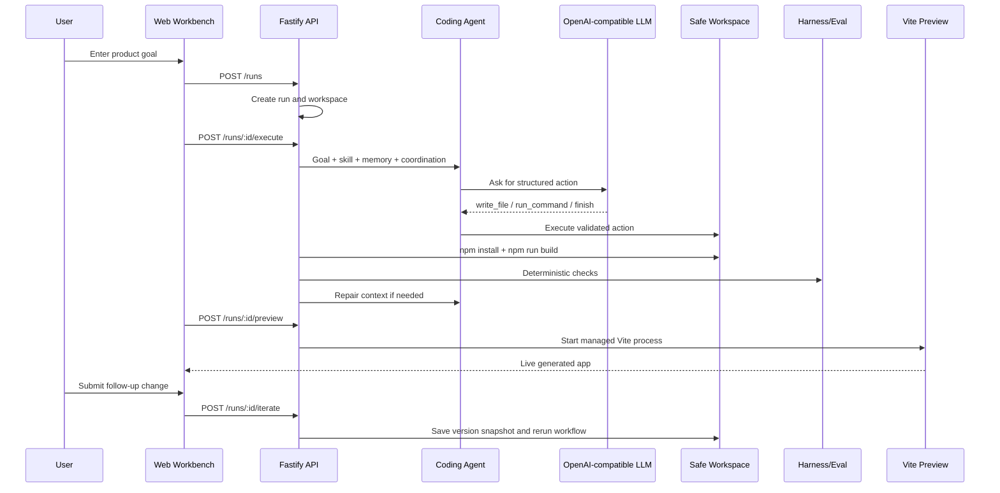
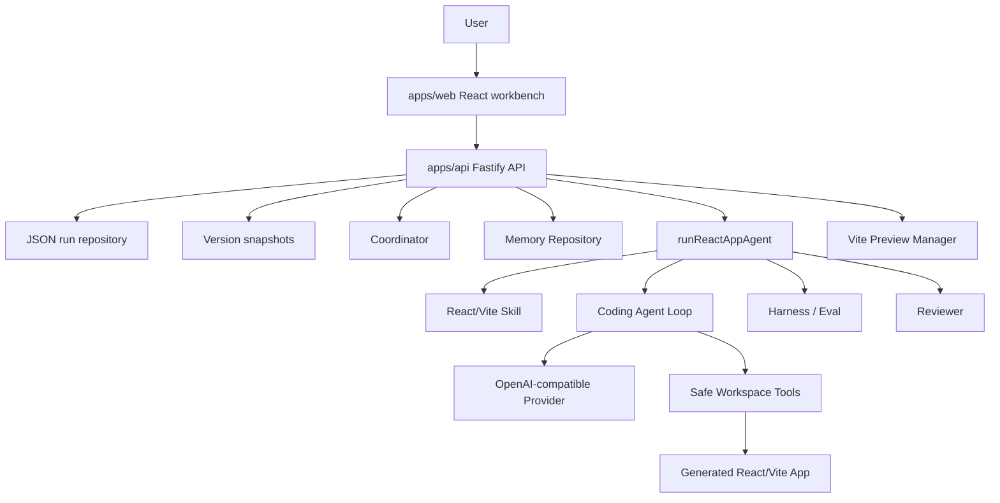

<div align="center">

# AppForge Agent Platform

**A real OpenAI-compatible coding-agent platform that generates, builds, evaluates, repairs, and previews React/Vite apps from natural language.**

[](https://www.typescriptlang.org/)
[](https://react.dev/)
[](https://vite.dev/)
[](https://fastify.dev/)
[](https://vitest.dev/)

[English](README.md) | [Chinese README](README.zh-CN.md) | [Product Design](docs/product_design.md) | [Current Status](docs/current_status.md)

</div>

---

## Why This Project Exists

AppForge is not a one-shot code-generation demo. It is a local, inspectable Agent
platform that proves the full engineering loop:

```text
goal -> plan -> generate -> build -> evaluate -> repair -> preview -> inspect
     -> iterate -> version snapshot
```

The main product path calls a real OpenAI-compatible LLM. Fake providers are used
only for deterministic automated tests.

## Demo Flow



## Highlights

| Area | What AppForge Implements |
| --- | --- |
| Real model path | OpenAI-compatible provider with configurable base URL, API key, model, and timeout |
| Agent loop | Structured actions, Zod validation, bounded steps, and finish policy |
| Workspace safety | Path containment, safe file IO, allowlisted commands, timeout/output limits |
| Build loop | Copy React/Vite starter, generate files, install dependencies, build app |
| Evaluation | Deterministic Harness checks plus reviewer decision |
| Repair | Configurable `maxRepairAttempts` with structured failure context |
| Human-in-the-loop | Approve or request repair with feedback |
| Observability | Plan, trace events, attempts, generated files, command output, preview |
| Versioning | Saved v1/v2/v3 snapshots for generated apps and version-specific preview |
| Iteration | Continue editing an existing run with a follow-up prompt |
| Persistence | Local JSON repositories for runs/results/versions and structured memory records |
| Workbench | Landing page, run workspace, version history, preview, inspector tabs |

## Workbench Preview

The web workbench has two surfaces:

- **Home:** create a run from a product goal and open recent runs.
- **Run Workspace:** inspect version history, run status, live preview, plan,
  trace, generated files, and follow-up iteration prompts.


## Architecture



## Monorepo Layout

```text
apps/
  api/                 Fastify API, orchestration, persistence, preview
  web/                 React/Vite workbench UI
packages/
  agent-core/          Provider, Coding Agent, loop, Coordinator, Skills, Memory
  workspace/           Safe file operations and command execution
  protocol/            Shared Zod schemas and protocol types
  harness/             Deterministic evaluation helpers
tests/
  fixtures/            Vite React starter copied into run workspaces
docs/
  product_design.md    Product and architecture design
  current_status.md    Current implementation and demo guide
```

## Quick Start

Create `.env` from `.env.example`:

```text
APPFORGE_LLM_BASE_URL=https://your-openai-compatible-endpoint/v1
APPFORGE_LLM_API_KEY=your-api-key
APPFORGE_LLM_MODEL=your-model-or-endpoint-id
APPFORGE_LLM_TIMEOUT_MS=60000
```

Install and start locally:

```powershell
Set-ExecutionPolicy -Scope Process -ExecutionPolicy Bypass
. .\scripts\use-local-tools.ps1
npm install
npm run dev:api
```

Start the web workbench in another terminal:

```powershell
. .\scripts\use-local-tools.ps1
npm run dev:web
```

Open:

```text
http://127.0.0.1:5173
```

## Useful Commands

```powershell
npm run typecheck
npm run test
npm run build
npm run smoke:llm
npm run smoke:agent-loop
npm run smoke:react-app
```

## API Surface

| Method | Route | Purpose |
| --- | --- | --- |
| `GET` | `/health` | API health check |
| `POST` | `/runs` | Create a run |
| `GET` | `/runs` | List runs |
| `GET` | `/runs/:id` | Load run and result |
| `DELETE` | `/runs/:id` | Delete run and workspace |
| `POST` | `/runs/:id/execute` | Execute the Agent workflow |
| `POST` | `/runs/:id/preview` | Start generated app preview |
| `GET` | `/runs/:id/files` | List generated files |
| `GET` | `/runs/:id/files/content` | Read generated file content |
| `GET` | `/runs/:id/versions/:versionNumber/files` | List files from a version snapshot |
| `GET` | `/runs/:id/versions/:versionNumber/files/content` | Read a file from a version snapshot |
| `POST` | `/runs/:id/iterate` | Continue editing a run and create a new version |
| `POST` | `/runs/:id/approve` | Human approval |
| `POST` | `/runs/:id/request-repair` | Human repair feedback |

## Safety Model

- Model output is treated as untrusted data.
- File operations are resolved inside a run-specific workspace root.
- Commands are allowlisted and bounded by timeout/output limits.
- The Agent is not given arbitrary shell access.
- Repair loops are bounded by `maxRepairAttempts`.
- Preview ports are checked before use and Vite uses strict port behavior.
- Memory injected into prompts is bounded by recency and character budget.

## Current Status

The main portfolio/demo loop is implemented:

```text
goal -> create run -> coordinate -> real LLM agent -> write files -> build
     -> evaluate -> review -> repair if needed -> save version -> preview
     -> inspect trace/files -> iterate with follow-up prompts
```

AppForge is local-first and portfolio-ready. It is not yet a production
multi-tenant SaaS.

## Resume Bullets

- Built a TypeScript monorepo Agent platform that uses a real OpenAI-compatible
  LLM to generate, build, evaluate, repair, and preview React/Vite apps.
- Implemented a safe workspace layer with bounded file operations, allowlisted
  command execution, and repair-loop limits.
- Designed a traceable Agent workflow with Coordinator planning, reusable Skills,
  structured Memory, Harness/Eval checks, human approval, JSON persistence,
  version snapshots, follow-up iteration, and live preview.
- Added deterministic tests with fake model providers while keeping the product
  path on real LLM execution.

## Roadmap

- Version diff and rollback on top of the existing v1/v2/v3 snapshot flow.
- Relevance-based Memory selection, compression, and optional LLM memory
  consolidation.
- More realistic multi-agent execution with separate planner, coder, reviewer,
  and test agents.
- Stronger sandboxing for command execution.
- Browser-based visual and behavior evaluation.
- Shareable run reports, export, and deployment packaging.
