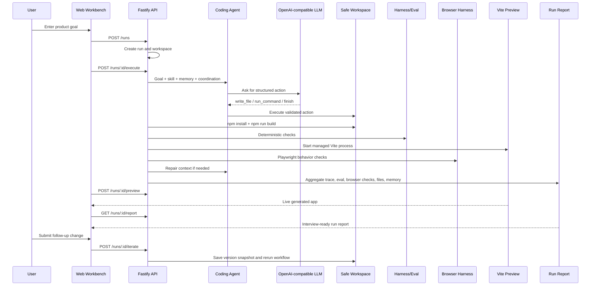
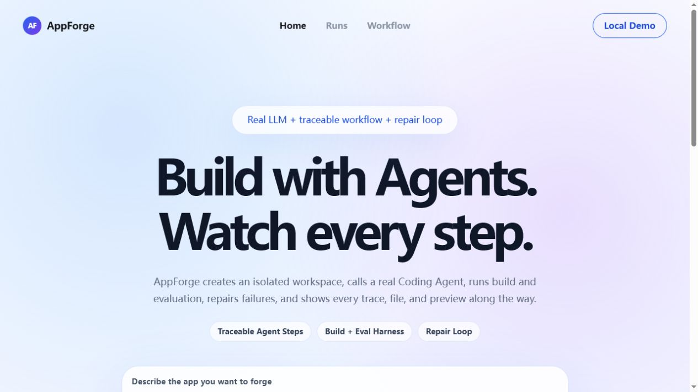
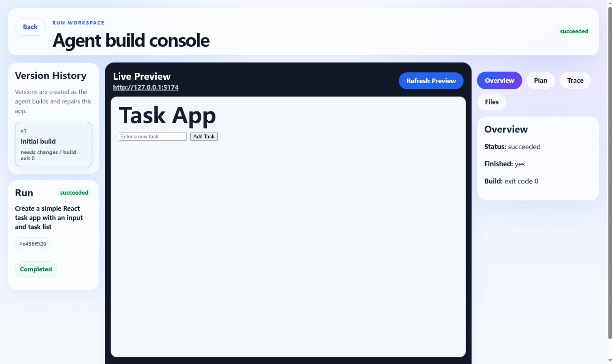
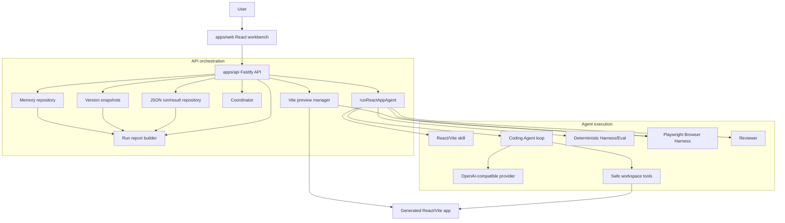

<div align="center">

# AppForge Agent Platform

**A real OpenAI-compatible coding-agent platform that generates, builds, evaluates, repairs, and previews React/Vite apps from natural language.**

[](https://www.typescriptlang.org/)
[](https://react.dev/)
[](https://vite.dev/)
[](https://fastify.dev/)
[](https://vitest.dev/)

[English](README.md) | [Chinese README](README.zh-CN.md) | [Architecture](docs/architecture.md) | [Product Design](docs/product_design.md) | [Current Status](docs/current_status.md)

</div>

---

## Why This Project Exists

AppForge is not a one-shot code-generation demo. It is a local, inspectable Agent
platform that proves the full engineering loop:

```text
goal -> plan -> generate -> build -> evaluate -> repair -> preview -> inspect
     -> iterate -> version snapshot
```

The main product path calls a real OpenAI-compatible LLM. Fake providers are used
only for deterministic automated tests.

## Portfolio Demo Flow



## Highlights

| Area | What AppForge Implements |
| --- | --- |
| Real model path | OpenAI-compatible provider with configurable base URL, API key, model, and timeout |
| Agent loop | Structured actions, Zod validation, bounded steps, and finish policy |
| Workspace safety | Path containment, safe file IO, allowlisted commands, timeout/output limits |
| Build loop | Copy React/Vite starter, generate files, install dependencies, build app |
| Evaluation | Deterministic Harness checks plus Playwright browser behavior checks |
| Repair | Configurable `maxRepairAttempts` with structured static/build/browser failure context |
| Human-in-the-loop | Approve or request repair with feedback |
| Observability | Plan, trace events, attempts, generated files, command output, browser checks, preview |
| Run reports | `GET /runs/:id/report` and Report tab summarize goal, versions, trace, eval, browser checks, files, and memory evidence |
| Versioning | Saved v1/v2/v3 snapshots for generated apps and version-specific preview |
| Iteration | Continue editing an existing run with a follow-up prompt |
| Memory | Persistent execution memory, rule-based summary memory, and keyword retrieval memory |
| Persistence | Local JSON repositories for runs/results/versions and structured memory records |
| Workbench | Landing page, run workspace, version history, preview, inspector tabs |

## Workbench Preview

The web workbench has two surfaces:

- **Home:** create a run from a product goal and open recent runs.
- **Run Workspace:** inspect version history, run status, live preview, plan,
  trace, generated files, run report, and follow-up iteration prompts.





## Architecture



## Memory Model

AppForge memory is an execution-experience store, not a raw chat transcript.
Completed runs save structured lessons that can improve later generation and
repair without copying full prior conversations into unrelated runs.

The current MVP has three layers:

| Layer | Purpose | Current Implementation |
| --- | --- | --- |
| Persistent Memory | Store one structured execution record per run | JSON-backed `MemoryEntry` records |
| Summary Memory | Compact many old records into long-term lessons | deterministic `MemorySummary` compaction |
| Retrieval Memory | Select memories relevant to the current goal | keyword-based retrieval before prompt injection |

The retrieval layer is intentionally pluggable. Keyword retrieval is used for the
local MVP and deterministic tests; embedding-based RAG retrieval is planned as a
future upgrade.

## Monorepo Layout

```text
apps/
  api/                 Fastify API, orchestration, persistence, preview
  web/                 React/Vite workbench UI
packages/
  agent-core/          Provider, Coding Agent, loop, Coordinator, Skills, Memory
  workspace/           Safe file operations and command execution
  protocol/            Shared Zod schemas and protocol types
  harness/             Deterministic and browser evaluation helpers
tests/
  fixtures/            Vite React starter copied into run workspaces
docs/
  product_design.md    Product and architecture design
  current_status.md    Current implementation and demo guide
```

## Quick Start

Create `.env` from `.env.example`:

```text
APPFORGE_LLM_BASE_URL=https://your-openai-compatible-endpoint/v1
APPFORGE_LLM_API_KEY=your-api-key
APPFORGE_LLM_MODEL=your-model-or-endpoint-id
APPFORGE_LLM_TIMEOUT_MS=120000
APPFORGE_LLM_HARD_TIMEOUT_MS=240000
APPFORGE_LLM_MAX_RETRIES=1
APPFORGE_LLM_STREAM=true
APPFORGE_LLM_SERVICE_TIER=auto
APPFORGE_PLANNER_TIMEOUT_MS=30000
APPFORGE_REVIEWER_TIMEOUT_MS=45000
APPFORGE_RUN_TIMEOUT_MS=1800000
APPFORGE_LLM_MAX_TOKENS=8000
APPFORGE_PARALLEL_CODING=true
APPFORGE_PARALLEL_CODER_CONCURRENCY=2
APPFORGE_PARALLEL_CODER_TIMEOUT_MS=240000
APPFORGE_PARALLEL_CODER_MAX_TOKENS=4000
APPFORGE_PARALLEL_CODER_THINKING=disabled
```

For Volcengine Ark, keep `APPFORGE_LLM_STREAM=true`: streamed SSE chunks
reset the provider's idle deadline while a long response is still making
progress. `APPFORGE_LLM_SERVICE_TIER=auto` uses a TPM guarantee package when
the endpoint has one and otherwise falls back to the ordinary service tier.
`APPFORGE_LLM_HARD_TIMEOUT_MS` is a separate absolute per-call deadline and is
never extended by SSE activity. The run-level deadline remains bounded by
`APPFORGE_RUN_TIMEOUT_MS`.

Fresh page generation is page-scoped. The Planner returns one entry for every
independent webpage or URL view, and the coordinator starts one initial Coding
API request per entry. A single-page request therefore uses one page request;
multi-page sites run those requests concurrently. Every page owns only
`src/pages/<page-id>.tsx`. Shared `src/content.ts`, `src/App.css`, and the hash
router in `src/App.tsx` are generated deterministically in-process and consume
no Coding API requests.

Page proposals remain in memory until all pages pass validation. If one page
fails, the coordinator retries only that page once within the same absolute
page deadline; successful pages are not regenerated. Provider-level retries
are disabled for page requests. The complete batch is written under a
workspace rollback transaction, so a failed batch cannot expose a partial
site. Existing-draft iterations remain on the focused single-agent path.
Planner and Reviewer are separate model requests in addition to page Coding
requests.

`APPFORGE_PARALLEL_CODER_CONCURRENCY` is capped at 6; keep the default of 2 for
Volcengine Ark endpoints unless the endpoint's concurrency, RPM, and TPM quotas
support more. The per-page hard timeout is absolute and is not extended by
streamed activity. Page agents use the smaller
`APPFORGE_PARALLEL_CODER_MAX_TOKENS` budget because each owns one component.
For deterministic page generation on Volcengine Ark, the default
`APPFORGE_PARALLEL_CODER_THINKING=disabled` avoids spending minutes on hidden
reasoning before emitting JSON; Planner and Reviewer requests are unaffected.

Install and start locally:

```powershell
Set-ExecutionPolicy -Scope Process -ExecutionPolicy Bypass
. .\scripts\use-local-tools.ps1
npm install
npm run dev:api
```

Start the web workbench in another terminal:

```powershell
. .\scripts\use-local-tools.ps1
npm run dev:web
```

Open:

```text
http://127.0.0.1:5173
```

## Useful Commands

```powershell
npm run typecheck
npm run test
npm run build
npm run smoke:llm
npm run smoke:agent-loop
npm run smoke:react-app
```

## API Surface

| Method | Route | Purpose |
| --- | --- | --- |
| `GET` | `/health` | API health check |
| `GET` | `/memory` | Inspect stored execution memory |
| `POST` | `/runs` | Create a run |
| `GET` | `/runs` | List runs |
| `GET` | `/runs/:id` | Load run and result |
| `GET` | `/runs/:id/report` | Load an interview-ready run report |
| `GET` | `/runs/:id/coordination` | Load planner/coder/reviewer assignments |
| `DELETE` | `/runs/:id` | Delete run and workspace |
| `POST` | `/runs/:id/execute` | Execute the Agent workflow |
| `POST` | `/runs/:id/preview` | Start generated app preview |
| `GET` | `/runs/:id/files?directory=src` | List generated files |
| `GET` | `/runs/:id/files?path=src/App.tsx` | Read a generated file |
| `GET` | `/runs/:id/versions/:versionNumber/files?path=src/App.tsx` | Read a file from a version snapshot |
| `POST` | `/runs/:id/iterate` | Continue editing a run and create a new version |
| `POST` | `/runs/:id/approve` | Human approval |
| `POST` | `/runs/:id/request-repair` | Human repair feedback |

## Safety Model

- Model output is treated as untrusted data.
- File operations are resolved inside a run-specific workspace root.
- Commands are allowlisted and bounded by timeout/output limits.
- The Agent is not given arbitrary shell access.
- Repair loops are bounded by `maxRepairAttempts`.
- Preview ports are checked before use and Vite uses strict port behavior.
- Browser evaluation uses a managed preview server and Playwright checks, and its
  failures are fed back into the bounded repair loop.
- Memory injected into prompts is selected by relevance, bounded by entry count
  and character budget, and can include compact long-term summaries.

## Current Status

The main portfolio/demo loop is implemented:

```text
goal -> create run -> coordinate -> real LLM agent -> write files -> build
     -> evaluate -> browser check -> review -> repair if needed -> save version -> preview
     -> inspect trace/files/report -> iterate with follow-up prompts
```

AppForge is local-first and portfolio-ready. It is not yet a production
multi-tenant SaaS.

## Resume Bullets

- Built a TypeScript monorepo Agent platform that uses a real OpenAI-compatible
  LLM to generate, build, evaluate, repair, and preview React/Vite apps.
- Implemented a safe workspace layer with bounded file operations, allowlisted
  command execution, and repair-loop limits.
- Designed a traceable Agent workflow with Coordinator planning, reusable Skills,
  three-layer Memory, deterministic Harness checks, Playwright browser checks,
  human approval, JSON persistence, version snapshots, follow-up iteration, and
  live preview.
- Added deterministic tests with fake model providers while keeping the product
  path on real LLM execution.

## Roadmap

- Version diff and rollback on top of the existing v1/v2/v3 snapshot flow.
- LLM-based memory compaction and embedding/RAG retrieval on top of the current
  deterministic Memory pipeline.
- More realistic multi-agent execution with separate planner, coder, reviewer,
  and test agents.
- A provider-based Image Asset Tool for controlled image search or generation,
  workspace-local asset storage, and an optional MCP adapter.
- Stronger sandboxing for command execution.
- Visual regression and screenshot comparison on top of the current Playwright
  behavior checks.
- Shareable run reports, export, and deployment packaging.
