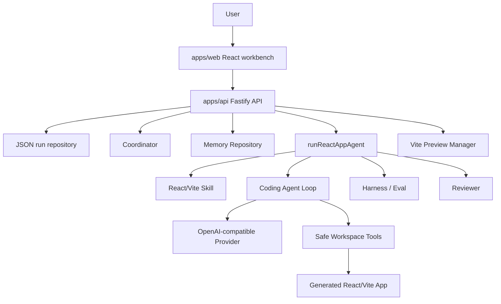

# AppForge Agent Platform

AppForge is a local Agent platform that turns a natural-language product goal
into a generated, built, evaluated, repaired, and previewable React/Vite
application.

The product path uses a real OpenAI-compatible LLM. Fake providers are used only
for deterministic automated tests.

## What It Does

- Creates isolated app workspaces from natural-language goals.
- Calls a real OpenAI-compatible model through a provider abstraction.
- Runs a structured Coding Agent loop that writes files and finishes through
  validated actions.
- Builds generated React/Vite apps with `npm install` and `npm run build`.
- Evaluates generated apps through deterministic Harness checks.
- Reviews results and runs bounded repair attempts when evaluation fails.
- Stores run history, results, attempts, trace events, generated files, and memory
  records in local JSON persistence.
- Supports human approval and repair feedback when a run needs review.
- Shows a web workbench with landing page, run workspace, version attempts, live
  preview, plan, trace, and file inspector.

## Architecture



## Core Workflow

1. The user creates a run from a natural-language goal.
2. The API creates a run record and an isolated workspace.
3. The React/Vite starter template is copied into the workspace.
4. The Coordinator creates a plan and planner/coder/reviewer assignments.
5. Skill rules, coordination context, and bounded memory context are sent to the
   Coding Agent.
6. The Coding Agent calls the LLM and parses a structured action such as
   `write_file`, `run_command`, or `finish`.
7. Workspace tools validate and execute the action inside the workspace boundary.
8. AppForge installs dependencies and builds the generated app.
9. Harness/Eval checks whether the app satisfies the goal.
10. The reviewer accepts the result or asks for repair.
11. If needed, AppForge runs repair attempts up to `maxRepairAttempts`.
12. The web workbench displays the result, trace, generated files, and live
    preview.

## Workbench

The web app has two main surfaces:

- **Home:** enter a goal, configure max repair attempts, create a run, and open
  recent runs.
- **Run Workspace:** inspect the current run with version attempts on the left,
  a large live preview in the center, and Overview/Plan/Trace/Files panels on the
  right.

The preview is served by a managed Vite process. The Preview panel can start a
preview server and refresh the iframe without recreating the run.

## Monorepo Layout

```text
apps/
  api/                 Fastify API, orchestration, persistence, preview
  web/                 React/Vite workbench UI
packages/
  agent-core/          Model provider, Coding Agent loop, Coordinator, Skills, Memory
  workspace/           Safe file operations and command execution
  protocol/            Shared Zod schemas and protocol types
  harness/             Deterministic evaluation helpers
tests/
  fixtures/            Vite React starter used by generated app runs
docs/
  product_design.md    Product and architecture design
```

## Documentation

- [Product design](docs/product_design.md)
- [Current status and demo guide](docs/current_status.md)
- [中文 README](README.zh-CN.md)
- [中文当前状态](docs/current_status.zh-CN.md)

## LLM Configuration

Create `.env` from `.env.example`:

```text
APPFORGE_LLM_BASE_URL=https://your-openai-compatible-endpoint/v1
APPFORGE_LLM_API_KEY=your-api-key
APPFORGE_LLM_MODEL=your-model-or-endpoint-id
APPFORGE_LLM_TIMEOUT_MS=60000
```

Volcengine Ark or another OpenAI-compatible provider can be used as long as the
endpoint follows a compatible chat-completions style API.

## Local Setup

This project requires Node.js 22 or newer. In this workspace, load the bundled
local tools before running npm commands:

```powershell
Set-ExecutionPolicy -Scope Process -ExecutionPolicy Bypass
. .\scripts\use-local-tools.ps1
npm install
```

Start the API:

```powershell
npm run dev:api
```

Start the web workbench in another terminal:

```powershell
npm run dev:web
```

Open:

```text
http://127.0.0.1:5173
```

## Useful Commands

```powershell
npm run typecheck
npm run test
npm run build
npm run smoke:llm
npm run smoke:agent-loop
npm run smoke:react-app
```

## API Surface

- `GET /health`
- `POST /runs`
- `GET /runs`
- `GET /runs/:id`
- `DELETE /runs/:id`
- `POST /runs/:id/execute`
- `POST /runs/:id/preview`
- `GET /runs/:id/files`
- `GET /runs/:id/files/content`
- `POST /runs/:id/approve`
- `POST /runs/:id/request-repair`

## Safety Model

- Model output is treated as untrusted data.
- File operations are resolved inside a run-specific workspace root.
- Commands are allowlisted and run with bounded execution behavior.
- The Agent is not given arbitrary shell access.
- Repair loops are bounded by `maxRepairAttempts`.
- Preview ports are checked before use and Vite is launched with strict port
  behavior.
- Memory injected into prompts is bounded by recency and character budget.

## Current Status

The main portfolio/demo flow is implemented:

```text
goal -> create run -> coordinate -> real LLM agent -> write files -> build
     -> evaluate -> review -> repair if needed -> preview -> inspect trace/files
```

The platform is local-first and resume-ready. It is not yet a production
multi-tenant SaaS.

## Current Limitations

- Target generation stack is React/Vite TypeScript.
- Version history currently shows attempts inside one run; full iterative
  versioning is planned.
- Memory uses structured local records, not vector search or relevance ranking
  yet.
- Coordinator creates deterministic plans and assignments; fully independent
  LLM-backed sub-agents are a future extension.
- JSON persistence is intended for local portfolio/demo usage, not production
  storage.
- Strong OS/container sandboxing is not yet implemented.

## Resume Bullets

- Built a TypeScript monorepo Agent platform that uses a real OpenAI-compatible
  LLM to generate, build, evaluate, repair, and preview React/Vite apps.
- Implemented a safe workspace layer with bounded file operations, allowlisted
  command execution, and repair-loop limits.
- Designed a traceable Agent workflow with Coordinator planning, reusable Skills,
  structured Memory, Harness/Eval checks, human approval, JSON persistence, and
  live preview.
- Added deterministic tests with fake model providers while keeping the product
  path on real LLM execution.

## Roadmap

- True versioning and iteration: `POST /runs/:id/iterate`, v1/v2/v3 snapshots,
  diff, rollback, and continue-edit flow.
- Relevance-based Memory selection and optional LLM memory consolidation.
- More realistic multi-agent execution with separate planner, coder, reviewer,
  and test agents.
- Stronger sandboxing for command execution.
- Richer visual evaluation with browser automation.
- Shareable run reports, export, and deployment packaging.
