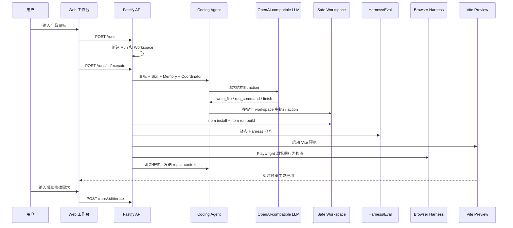
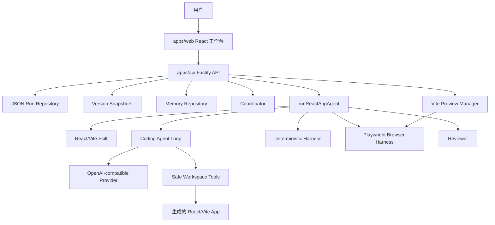

<div align="center">

# AppForge Agent Platform

**一个真实 OpenAI-compatible Coding Agent 平台：用自然语言生成、构建、评估、修复、预览并持续迭代 React/Vite 应用。**

[English README](README.md) | [产品设计](docs/product_design.zh-CN.md) | [当前状态](docs/current_status.zh-CN.md)

</div>

---

## 项目定位

AppForge 不是一次性的代码生成 demo，而是一个本地可运行、可观察、可修复、可持续迭代的 Agent 平台。

核心闭环：

```text
目标 -> 规划 -> 生成代码 -> 安装依赖 -> 构建 -> 静态评估
     -> 浏览器行为评估 -> Review -> 自动修复 -> 版本快照
     -> 实时预览 -> 继续迭代
```

产品主链路使用真实 OpenAI-compatible LLM。Fake/Mock 只用于自动化测试。

## 当前能力

| 模块 | 能力 |
| --- | --- |
| 真实模型链路 | 支持 OpenAI-compatible base URL、API key、model、timeout |
| Coding Agent | 通过结构化 action 写文件、执行受控命令、结束任务 |
| Safe Workspace | 路径边界、文件读写限制、命令 allowlist、timeout |
| Coordinator | 生成 planner、coder、reviewer 的任务分工 |
| Harness/Eval | 静态结构检查、语言检查、页面内容检查 |
| Browser Harness | 使用 Playwright 打开真实预览页面，检查页面加载、可见内容、输入框、按钮和任务添加行为 |
| 自动修复 | build/eval/browser eval 失败都会进入 bounded repair loop |
| Trace | 记录 copy template、Agent、install、build、eval、browser eval、review 等事件 |
| Memory | Persistent Memory、Summary Memory、Retrieval Memory 三层 MVP |
| Versioning | 保存 v1/v2/v3 快照，可预览指定版本 |
| Web Workbench | 首页、Run Workspace、版本历史、实时预览、Browser Checks、Plan/Trace/Files |

## 演示流程



## 架构



## 快速启动

创建 `.env`：

```text
APPFORGE_LLM_BASE_URL=https://your-openai-compatible-endpoint/v1
APPFORGE_LLM_API_KEY=your-api-key
APPFORGE_LLM_MODEL=your-model-or-endpoint-id
APPFORGE_LLM_TIMEOUT_MS=60000
```

启动后端：

```powershell
Set-ExecutionPolicy -Scope Process -ExecutionPolicy Bypass
. .\scripts\use-local-tools.ps1
npm install
npm run dev:api
```

另开一个终端启动前端：

```powershell
. .\scripts\use-local-tools.ps1
npm run dev:web
```

打开：

```text
http://127.0.0.1:5173
```

## 演示检查清单

- 从 Web 工作台创建一个 run。
- 执行 run，展示真实 LLM 生成的代码。
- 展示 build、静态 eval、browser eval、review 和 trace。
- 启动 preview，展示 Browser Checks。
- 输入后续修改需求，生成新版本快照。
- 打开 Files 查看生成文件。
- 解释 Safe Workspace、命令 allowlist、bounded repair loop。

## 简历表述

- 从零实现 TypeScript Monorepo Agent 平台，使用真实 OpenAI-compatible LLM 自动生成、构建、评估、修复并预览 React/Vite 应用。
- 设计 Safe Workspace 安全边界，支持路径 containment、受控文件读写、allowlisted command execution 和 bounded repair loop。
- 构建可观察 Agent 工作流，包含 Coordinator、Skill、三层 Memory、Trace、Harness/Eval、Playwright Browser Harness、Human-in-the-loop、JSON 持久化、版本快照和实时预览。
- 使用 FakeModelProvider 编写确定性自动化测试，同时保持产品主链路使用真实 LLM。

## 后续增强

- 版本 diff 和 rollback。
- LLM-based memory compaction 和 embedding/RAG retrieval。
- 更真实的多 Agent：planner、coder、reviewer、test agent 分开执行。
- 更强的命令执行沙箱。
- 在当前 Playwright 行为检查基础上增加截图对比、可访问性检查和视觉评估。
- Shareable run report、截图导出和部署包装。
