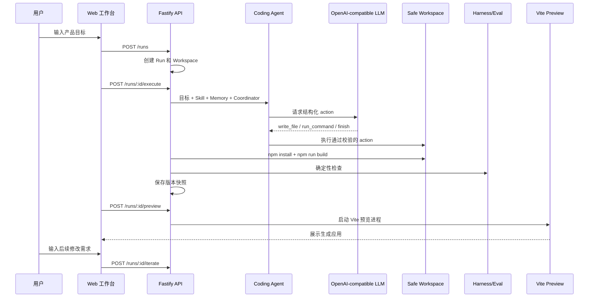
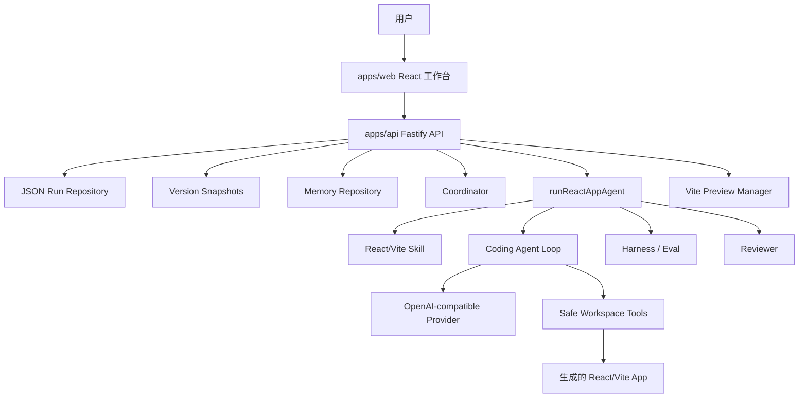

<div align="center">

# AppForge Agent Platform

**一个真实 OpenAI-compatible Coding Agent 平台：用自然语言生成、构建、评估、修复、迭代并预览 React/Vite 应用。**

[](https://www.typescriptlang.org/)
[](https://react.dev/)
[](https://vite.dev/)
[](https://fastify.dev/)
[](https://vitest.dev/)

[English README](README.md) · [产品设计](docs/product_design.zh-CN.md) · [当前状态](docs/current_status.zh-CN.md)

</div>

---

## 为什么做这个项目

AppForge 不是一次性的代码生成 demo，而是一个本地可运行、可观察、可修复、可继续迭代的 Agent 平台。

它验证的是完整工程闭环：

```text
目标 -> 规划 -> 生成 -> 构建 -> 评估 -> 修复 -> 版本快照 -> 预览 -> 继续迭代
```

产品主链路调用真实 OpenAI-compatible LLM。Fake/Mock Provider 只用于自动化测试。

## 演示流程



## 项目亮点

| 模块 | 已实现能力 |
| --- | --- |
| 真实模型链路 | OpenAI-compatible provider，支持 base URL、API key、model、timeout |
| Agent Loop | 结构化 action、Zod 校验、步数预算、finish 停止策略 |
| 安全 Workspace | 路径边界、文件读写、命令 allowlist、timeout 和输出限制 |
| 构建闭环 | 复制 React/Vite starter、生成文件、安装依赖、构建应用 |
| Harness/Eval | 对生成应用做确定性检查 |
| 自动修复 | 支持 `maxRepairAttempts` 和结构化失败上下文 |
| 人工介入 | 支持 Approve 和 Request Repair Feedback |
| 版本系统 | 保存 v1/v2/v3 应用快照，并可预览指定版本 |
| 继续迭代 | 在已有 Run 上输入后续修改需求，生成新版本 |
| 可观测性 | Plan、Trace、Attempts、生成文件、命令输出、实时预览 |
| 持久化 | 本地 JSON 保存 Runs、Results、Versions、Memory |
| Web 工作台 | 首页、Run Workspace、版本历史、预览、右侧检查面板 |

## Web 工作台

当前前端分为两个主要界面：

- **Home：** 输入目标、设置最大修复次数、创建 Run、打开最近 Run。
- **Run Workspace：** 左侧显示版本历史和当前 Run，中间是大面积实时预览与继续修改输入框，右侧是 Overview / Plan / Trace / Files。


## 架构图



## Monorepo 结构

```text
apps/
  api/                 Fastify API、编排、持久化、版本快照、预览
  web/                 React/Vite Web 工作台
packages/
  agent-core/          Provider、Coding Agent、Loop、Coordinator、Skills、Memory
  workspace/           安全文件操作和命令执行
  protocol/            共享 Zod Schema 和协议类型
  harness/             确定性评估工具
tests/
  fixtures/            每个 Run 会复制的 Vite React starter
docs/
  product_design.md    产品和架构设计
  current_status.md    当前实现和演示指南
```

## 快速启动

复制 `.env.example` 为 `.env`：

```text
APPFORGE_LLM_BASE_URL=https://your-openai-compatible-endpoint/v1
APPFORGE_LLM_API_KEY=your-api-key
APPFORGE_LLM_MODEL=your-model-or-endpoint-id
APPFORGE_LLM_TIMEOUT_MS=60000
```

安装并启动后端：

```powershell
Set-ExecutionPolicy -Scope Process -ExecutionPolicy Bypass
. .\scripts\use-local-tools.ps1
npm install
npm run dev:api
```

另开一个终端启动前端：

```powershell
. .\scripts\use-local-tools.ps1
npm run dev:web
```

打开：

```text
http://127.0.0.1:5173
```

## 常用命令

```powershell
npm run typecheck
npm run test
npm run build
npm run smoke:llm
npm run smoke:agent-loop
npm run smoke:react-app
```

## 安全边界

- 模型输出被视为不可信数据。
- 文件操作必须限制在 Run 对应的 Workspace 内。
- 命令执行使用 allowlist，并限制 timeout 和输出大小。
- Agent 不获得任意 shell 权限。
- Repair loop 由 `maxRepairAttempts` 限制。
- 预览端口会先检查占用，并使用 Vite strict port。
- Memory 注入 prompt 时限制最近记录和字符长度。

## 当前状态

主线 demo 已经跑通：

```text
目标 -> 创建 Run -> Coordinator 分工 -> 真实 LLM Agent -> 写文件 -> 构建
    -> 评估 -> 审查 -> 必要时修复 -> 保存版本 -> 预览
    -> 查看 Trace/Files -> 输入后续需求继续迭代
```

这个项目已经具备简历展示价值。它现在是本地优先的 Agent 平台，不是生产级多租户 SaaS。

## 简历表述

- 从零实现 TypeScript Monorepo Agent 平台，使用真实 OpenAI-compatible LLM 完成 React/Vite 应用的生成、构建、评估、修复、版本化和预览。
- 设计安全 Workspace 层，实现路径边界控制、allowlisted command execution 和有界 repair loop。
- 构建可观测 Agent 工作流，包含 Coordinator、Skill、Memory、Trace、Harness/Eval、Human-in-the-loop、JSON 持久化、版本快照、继续迭代和实时预览。
- 使用 FakeModelProvider 编写确定性测试，同时保持产品主链路使用真实 LLM。

## 后续增强

- 版本 diff 和 rollback：在已有 v1/v2/v3 快照基础上支持对比和回滚。
- Memory 相关性筛选、压缩和可选 LLM 记忆总结。
- 更真实的多 Agent：planner、coder、reviewer、test agent 分开对话和协作。
- 更强的命令执行沙箱。
- 基于浏览器自动化的视觉和行为评估。
- 可分享 Run Report、截图导出和部署包装。
