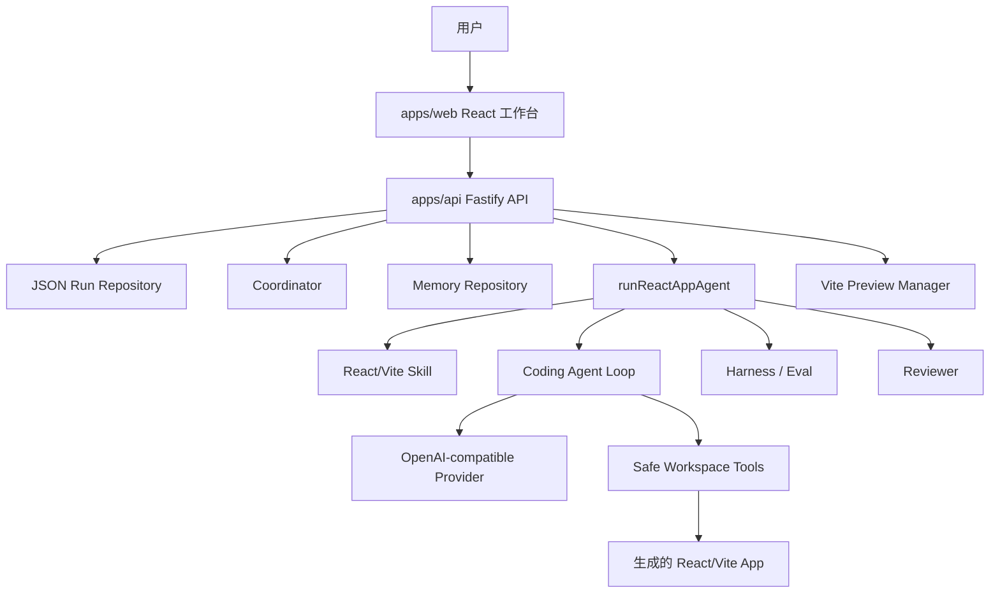

# AppForge Agent Platform

AppForge 是一个本地 Agent 平台：用户输入自然语言产品目标后，系统会调用真实的 OpenAI-compatible LLM，自动生成、构建、评估、修复并预览 React/Vite 应用。

产品主链路使用真实 LLM。Fake/Mock Provider 只用于自动化测试，方便稳定验证流程。

## 项目能力

- 根据自然语言目标创建隔离的应用工作区。
- 通过 Provider 抽象接入真实 OpenAI-compatible 模型。
- 运行结构化 Coding Agent loop，让模型返回 `write_file`、`run_command`、`finish` 等动作。
- 对生成的 React/Vite 应用执行 `npm install` 和 `npm run build`。
- 使用 Harness 做确定性的功能评估。
- 使用 Reviewer 判断结果是否通过，不通过时进入有限次数的自动修复。
- 使用本地 JSON 持久化保存 run 历史、结果、attempts、trace、生成文件和 memory。
- 支持 Human-in-the-loop：人工 approve 或提交 repair feedback。
- 提供 Web 工作台：创建任务、查看版本尝试、实时预览、Plan、Trace、Files。

## 架构图



## 主流程

1. 用户在 Web 工作台输入目标并创建 run。
2. API 创建 run 记录和隔离 workspace。
3. 系统把 React/Vite starter 复制到 workspace。
4. Coordinator 生成计划和 planner/coder/reviewer 分工。
5. Skill 规则、coordination context、memory context 一起进入 Agent prompt。
6. Coding Agent 调用 LLM，获得结构化 action。
7. Workspace 工具在安全目录内执行写文件或命令。
8. 系统执行 `npm install` 和 `npm run build`。
9. Harness 检查生成结果是否满足目标。
10. Reviewer 判断是否通过。
11. 如果失败且还有修复次数，进入 repair loop。
12. 前端展示结果、Trace、生成文件和实时预览。

## Web 工作台

当前 Web 端分成两个主要界面：

- **Home：** 输入目标、设置最大修复次数、创建 run、打开最近的 run。
- **Run Workspace：** 左侧显示当前 run 和版本尝试，中间是大面积实时预览，右侧是 Overview、Plan、Trace、Files 检查面板。

预览由后端管理 Vite 进程。Preview 面板可以启动预览服务，也可以刷新 iframe。

## Monorepo 结构

```text
apps/
  api/                 Fastify API、编排、持久化、预览
  web/                 React/Vite Web 工作台
packages/
  agent-core/          Model Provider、Agent loop、Coordinator、Skills、Memory
  workspace/           安全文件操作和命令执行
  protocol/            共享 Zod schema 和协议类型
  harness/             确定性评估和检查逻辑
tests/
  fixtures/            Vite React starter 模板
docs/
  product_design.md    产品和架构设计
```

## 文档入口

- [Product design](docs/product_design.md)
- [Current status and demo guide](docs/current_status.md)
- [中文当前状态](docs/current_status.zh-CN.md)

## LLM 配置

复制 `.env.example` 为 `.env`，填写：

```text
APPFORGE_LLM_BASE_URL=https://your-openai-compatible-endpoint/v1
APPFORGE_LLM_API_KEY=your-api-key
APPFORGE_LLM_MODEL=your-model-or-endpoint-id
APPFORGE_LLM_TIMEOUT_MS=60000
```

只要服务兼容 OpenAI 风格接口，就可以接入，例如火山方舟等 OpenAI-compatible Provider。

## 本地启动

项目要求 Node.js 22 或更新版本。本工作区先加载本地工具：

```powershell
Set-ExecutionPolicy -Scope Process -ExecutionPolicy Bypass
. .\scripts\use-local-tools.ps1
npm install
```

启动后端：

```powershell
npm run dev:api
```

另开一个终端启动前端：

```powershell
npm run dev:web
```

浏览器打开：

```text
http://127.0.0.1:5173
```

## 常用命令

```powershell
npm run typecheck
npm run test
npm run build
npm run smoke:llm
npm run smoke:agent-loop
npm run smoke:react-app
```

## API

- `GET /health`
- `POST /runs`
- `GET /runs`
- `GET /runs/:id`
- `DELETE /runs/:id`
- `POST /runs/:id/execute`
- `POST /runs/:id/preview`
- `GET /runs/:id/files`
- `GET /runs/:id/files/content`
- `POST /runs/:id/approve`
- `POST /runs/:id/request-repair`

## 安全边界

- 模型输出被视为不可信数据。
- 文件读写必须限制在 run 对应的 workspace 内。
- 命令执行使用 allowlist，不开放任意 shell。
- Agent 不直接获得宿主机权限。
- repair loop 有次数上限。
- 预览端口会先检查是否被占用，并使用 Vite strict port。
- Memory 注入 prompt 时限制最近记录和字符长度。

## 当前状态

主线 demo 已经跑通：

```text
目标 -> 创建 run -> 协调计划 -> 真实 LLM Agent -> 写文件 -> 构建
    -> 评估 -> 审查 -> 必要时修复 -> 预览 -> 查看 Trace/Files
```

这个项目已经具备简历展示价值。它现在是本地优先的 Agent 平台，不是生产级多租户 SaaS。

## 当前限制

- 当前目标技术栈是 React/Vite TypeScript。
- Version History 目前展示的是单个 run 内部的 attempts；真正的 v1/v2/v3 迭代版本还在 roadmap。
- Memory 目前是结构化本地记录，还没有向量检索、相关性排序和自动压缩。
- Coordinator 目前做确定性的计划和分工，还不是多个 LLM 子 Agent 并行独立执行。
- JSON 持久化适合本地 demo，不适合生产多用户存储。
- 目前是应用层安全边界，还没有接入容器级或系统级沙箱。

## 简历表述

- 从零实现 TypeScript Monorepo Agent 平台，使用真实 OpenAI-compatible LLM 完成 React/Vite 应用的生成、构建、评估、修复和预览。
- 设计安全 workspace 层，实现路径边界控制、allowlisted command execution 和有限 repair loop。
- 构建可观测 Agent 工作流，包含 Coordinator、Skill、Memory、Trace、Harness/Eval、Human-in-the-loop、JSON 持久化和实时预览。
- 使用 FakeModelProvider 编写确定性测试，同时保持产品主链路使用真实 LLM。

## 后续增强

- 真正的版本迭代：`POST /runs/:id/iterate`、v1/v2/v3 快照、diff、rollback、继续修改。
- Memory 相关性筛选、预算控制和可选 LLM 记忆压缩。
- 更真实的多 Agent：planner、coder、reviewer、test agent 分工协作。
- 更强的命令执行沙箱。
- 基于浏览器自动化的视觉和行为评估。
- 可分享 run report、导出和部署包装。
