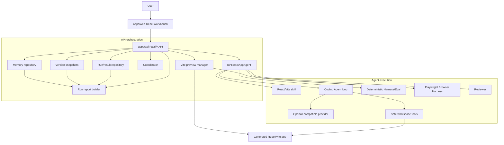
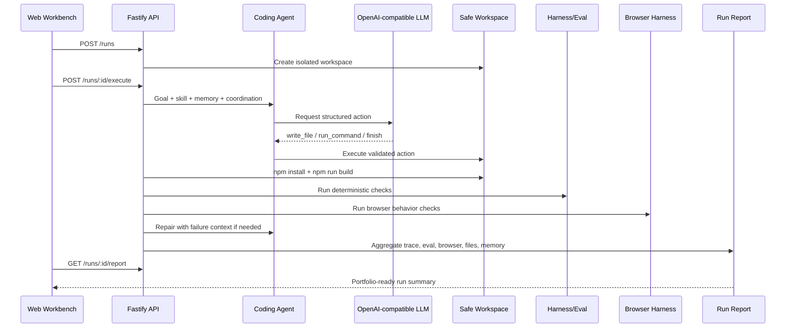

# AppForge Architecture

AppForge is a local-first Agent platform for generating, validating, repairing,
previewing, and iterating React/Vite apps from natural language.

The system is intentionally split into three layers:

- **Workbench layer:** user-facing React UI for creating runs, previewing apps,
  inspecting trace/files/report, and submitting follow-up changes.
- **Orchestration layer:** Fastify API that owns run state, workspace creation,
  execution, versions, memory, preview, and report generation.
- **Agent execution layer:** real OpenAI-compatible LLM calls, safe workspace
  tools, deterministic eval, browser eval, review, and bounded repair.

## System Diagram

## Execution Loop

## Security Boundaries

- Model output is parsed as untrusted structured data.
- Workspace file operations are resolved inside a run-specific root.
- Command execution is allowlisted and bounded by timeout/output limits.
- Repair loops are bounded by `maxRepairAttempts`.
- Browser evaluation runs against a managed preview URL.
- Memory injection is bounded by relevance, entry count, and character budget.

## Why This Is More Than a Demo

AppForge does not stop at generating code. It records the evidence needed to
trust or reject a result:

- build result;
- deterministic eval checks;
- browser behavior checks;
- review decision;
- repair attempts;
- trace events;
- version snapshots;
- generated files;
- memory records;
- run report.

That evidence chain is what makes the platform explainable in a portfolio or
interview setting.
