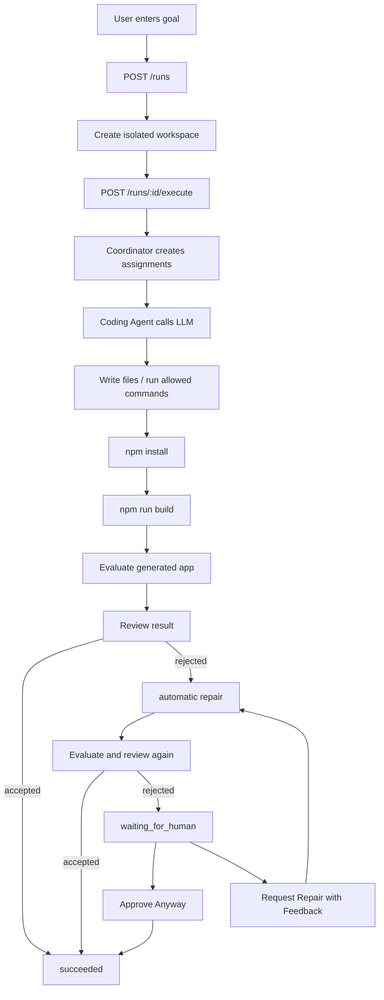

# AppForge Workflow

AppForge is an agent platform that turns a natural-language product goal into a generated React/Vite application.

The platform is designed around a real coding workflow: create a run, generate code with an OpenAI-compatible LLM, build the app, evaluate the result, repair failures, and allow a human to intervene when automation is not confident enough.

## Core Flow

1. The user creates a run with a natural-language goal.
2. The API creates an isolated workspace for that run.
3. The coordinator creates planner, coder, and reviewer assignments.
4. The coding agent calls an OpenAI-compatible LLM.
5. The agent writes files or runs allowed commands inside the workspace.
6. The API installs dependencies and builds the generated app.
7. The evaluator checks whether the generated app satisfies the goal.
8. The reviewer decides whether the run should be accepted.
9. If the result is rejected, the system performs an automatic repair attempt.
10. If repair still fails, the run enters human review.
11. A human can approve the result or request another repair with feedback.
12. The generated app can be previewed with a local Vite server.

## Run Statuses

- `queued`: The run has been created but has not started execution.
- `running`: The agent is executing the main generation flow.
- `repairing`: The system is applying a repair request.
- `succeeded`: The result was accepted by the reviewer or approved by a human.
- `failed`: Execution crashed or the platform could not complete the run.
- `waiting_for_human`: Automated review rejected the result and human input is required.

## Main Loop

## Human-in-the-loop

Human-in-the-loop is used when the automated workflow is not confident enough to accept the generated result.

The platform currently supports two human actions:

- `Approve Anyway`: The human accepts the generated result and marks the run as `succeeded`.
- `Request Repair`: The human provides feedback, and the platform sends the original goal plus that feedback back into the agent flow.

This keeps the system controllable. The platform does not blindly trust the agent, and the user can intervene when automated evaluation is too strict or the generated app is incomplete.

## Safety Boundaries

Generated work runs inside an isolated workspace. File operations are restricted to the workspace root, and command execution is limited to allowed commands.

Current safety boundaries include:

- Workspace path resolution prevents file access outside the run directory.
- File reads and writes go through workspace helper functions.
- Command execution is checked against an allowlist.
- Preview servers are launched per run.
- Human approval is only allowed when a run is `waiting_for_human`.
- Human repair is only allowed when a run is `waiting_for_human`.

## Eval and Review

The evaluator checks concrete properties of the generated React app.

Current eval checks include:

- readable text
- requested language matching
- task app structure when the goal asks for a task app
- content page structure when the goal asks for an introduction or about page

The reviewer combines:

- whether the agent finished
- whether install passed
- whether build passed
- whether eval passed

If all checks pass, the run is accepted. Otherwise, it is rejected and may enter automatic repair or human review.

