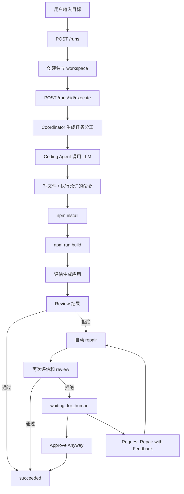

# AppForge 工作流

AppForge 是一个 Agent 平台，可以把用户的自然语言产品目标转换成一个生成出来的 React/Vite 应用。

这个平台的核心不是简单 demo，而是围绕真实 Coding Agent 流程设计：创建任务、调用 OpenAI-compatible LLM 生成代码、构建应用、自动评估、失败修复，并在自动化不够可靠时交给人类审核。

## 核心流程

1. 用户用自然语言创建一个 run。
2. API 为这个 run 创建独立 workspace。
3. Coordinator 生成 planner、coder、reviewer 三类任务分工。
4. Coding Agent 调用 OpenAI-compatible LLM。
5. Agent 在 workspace 内写文件或执行允许的命令。
6. API 安装依赖并构建生成出来的应用。
7. Evaluator 检查生成结果是否满足用户目标。
8. Reviewer 判断这次 run 是否可以被接受。
9. 如果结果被拒绝，系统会自动进行一次 repair。
10. 如果 repair 后仍然失败，run 进入人工审核状态。
11. 人类可以选择直接批准结果，或者带反馈请求再次修复。
12. 用户可以通过本地 Vite preview 查看生成出来的应用。

## Run 状态

- `queued`：run 已创建，但还没有开始执行。
- `running`：Agent 正在执行主要生成流程。
- `repairing`：系统正在根据反馈进行修复。
- `succeeded`：结果被 reviewer 接受，或被人类审核批准。
- `failed`：执行崩溃，或平台无法完成这次 run。
- `waiting_for_human`：自动 review 拒绝了结果，需要人类介入。

## 主循环

## Human-in-the-loop

Human-in-the-loop 用在自动化流程没有足够把握接受生成结果的时候。

目前平台支持两种人工操作：

- `Approve Anyway`：人类审核后认为结果可以接受，把 run 标记为 `succeeded`。
- `Request Repair`：人类输入反馈，平台把原始目标和反馈一起送回 Agent 流程，让 Agent 再修一次。

这样平台不会盲目信任 Agent。自动 eval 太严格时，人可以放行；生成结果确实不完整时，人也可以给出更具体的修复方向。

## 安全边界

生成代码运行在独立 workspace 中。文件操作被限制在 workspace root 内，命令执行也只允许通过白名单检查。

当前安全边界包括：

- workspace 路径解析会阻止访问 run 目录之外的文件。
- 文件读写通过 workspace helper 函数完成。
- 命令执行必须通过 allowlist 检查。
- 每个 run 的 preview server 独立启动。
- 只有 `waiting_for_human` 状态的 run 才能被人工批准。
- 只有 `waiting_for_human` 状态的 run 才能请求人工反馈修复。

## Eval 和 Review

Evaluator 会检查生成出来的 React 应用是否具备具体可验证的特征。

当前 eval 检查包括：

- 文本是否可读
- 生成内容是否匹配用户请求的语言
- 如果目标是任务应用，检查任务应用结构
- 如果目标是介绍页或内容页，检查页面内容结构

Reviewer 综合判断：

- Agent 是否正常结束
- install 是否通过
- build 是否通过
- eval 是否通过

如果全部通过，run 会被接受。否则 run 会进入自动 repair，或者进入人工审核状态。

