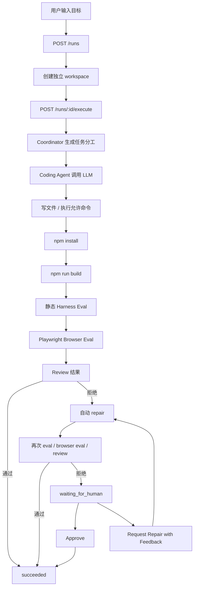

# AppForge 工作流

AppForge 是一个 Agent 平台，可以把用户的自然语言产品目标转换成一个真实生成出来的 React/Vite 应用。

它不是简单 demo，而是围绕真实 Coding Agent 流程设计：

```text
创建任务 -> 调用真实 LLM -> 生成代码 -> 构建应用
-> 静态评估 -> 浏览器行为评估 -> Review
-> 自动修复 -> 人工介入 -> 继续迭代
```

## 核心流程

1. 用户用自然语言创建一个 run。
2. API 为这个 run 创建独立 workspace。
3. Coordinator 生成 planner、coder、reviewer 的任务分工。
4. Coding Agent 调用 OpenAI-compatible LLM。
5. Agent 在 workspace 内写文件或执行允许的命令。
6. API 安装依赖并构建生成出来的应用。
7. Deterministic Harness 检查源码结构、语言、页面内容等。
8. Browser Harness 启动 Vite preview，并用 Playwright 检查真实页面行为。
9. Reviewer 判断这次 run 是否可以接受。
10. 如果结果被拒绝，系统自动进入 repair。
11. 如果自动 repair 后仍然失败，run 进入人工审核状态。
12. 人类可以 Approve，也可以输入反馈 Request Repair。
13. 用户可以继续输入新需求，基于当前版本生成新快照。

## Run 状态

- `queued`：run 已创建，但还没有开始执行。
- `running`：Agent 正在执行主要生成流程。
- `repairing`：系统正在根据反馈进行修复。
- `succeeded`：结果被 reviewer 接受，或被人工批准。
- `failed`：执行崩溃，或平台无法完成这次 run。
- `waiting_for_human`：自动 review 拒绝结果，需要人工介入。

## 主循环



## Browser Harness

Browser Harness 用来验证“页面在真实浏览器里是否真的能用”。

当前检查包括：

- 页面能否加载；
- body 是否有可见文本；
- task/todo/list 类型目标是否有输入框；
- 是否有按钮；
- 输入任务并点击按钮后，任务文本是否出现在页面上。

如果 Browser Eval 失败，它会进入 `review`，然后触发自动 repair。失败原因会写入 repair context，例如：

```text
Browser eval checks:
- adds a task item: failed (The task text was not rendered.)
```

这样下一轮 Agent 不只是修“代码长得像不像”，而是修“真实页面行为是否正确”。

## Human-in-the-loop

Human-in-the-loop 用在自动化流程没有足够把握接受生成结果的时候。

当前支持两种人工动作：

- `Approve`：人类认为结果可以接受，把 run 标记为 `succeeded`。
- `Request Repair`：人类输入反馈，平台把原始目标和反馈一起送回 Agent，让 Agent 再修一次。

## Eval 和 Review

Reviewer 综合判断：

- Agent 是否正常结束；
- install 是否通过；
- build 是否通过；
- deterministic eval 是否通过；
- browser eval 是否通过。

只要其中关键检查失败，run 就会被拒绝，并进入自动 repair 或人工审核。
